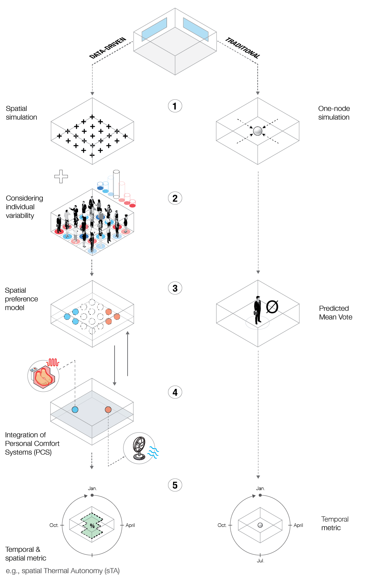

This is a GitHub page for the manuscript entitled: \
**"Designing for spatial Thermal Autonomy and active occupant adaption: Re-thinking the role of thermal comfort evaluation in early planning stages"** \
submitted to *Building and Environment*.

Authors: Kramer, T., Schiavon, S., Garcia-Hansen, V., Nik, V. M. (2023).

At this stage, the repository contains a [Jupyter Notebook](/workflow/workflow.ipynb) outlining the proposed workflow. The content of the notebook focuses specifically on the newly introduced components, such as using a personalised classification scheme, spatial thermal preference prediction or the implementation of PCS and sTA for thermal comfort modelling.

We are currently in the process of streamlining our original code into this notebook. It will also act as an example of how to use the *comfortSIM* Python [modules](/lib/comfortSIM). Most functions currently defined in the notebook will be part of the *comfortSIM* library. With this Python library we aim to develop an interface between two-dimensional building simulation and common Data Science and Machine Learning libraries.

 

If you have questions about the parts not covered in too much detail for now, or if you have suggestions and want to support me developing *comfortSIM*, feel free to reach out to me here on GitHub.